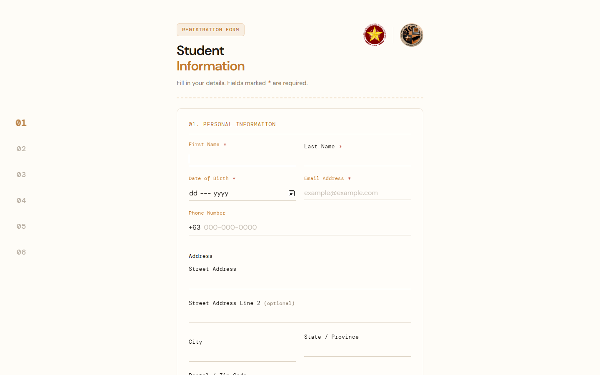

# Student Registration

<p align="center">
  <strong>Multi-section student registration form with live validation.</strong><br>
  Notebook-inspired layout. Vanilla HTML, CSS, and JavaScript.
</p>

<p align="center">
  <a href="https://cikeyz.github.io/student-registration/">Live Demo</a>
  &nbsp;·&nbsp;
  <a href="#quick-start">Quick Start</a>
  &nbsp;·&nbsp;
  <a href="#project-structure">Structure</a>
  &nbsp;·&nbsp;
  <a href="#license">License</a>
</p>

<p align="center">
  
  
  
  
  
</p>

## Contents

- [Overview](#overview)
- [Features](#features)
- [Screenshots](#screenshots)
- [Quick Start](#quick-start)
- [Project Structure](#project-structure)
- [License](#license)
- [Course Note](#course-note)

## Overview

A front-end student registration form for a Computer Engineering context. Fieldsets cover personal, academic, and account details with client-side validation, password feedback, and a lightweight section stepper. No backend is required for the demo.

## Features

| Feature | Description |
|---------|-------------|
| Multi-fieldset form | Personal, academic, and account sections |
| Client validation | Required fields, patterns, and password rules |
| Stepper / progress | Section guidance while filling the form |
| Branding assets | PUP and program logos |

## Screenshots

| Form |
|------|
|  |

## Quick Start

```bash
git clone https://github.com/cikeyz/student-registration.git
cd student-registration
python -m http.server 8000
# http://localhost:8000
```

## Project Structure

```text
student-registration/
├── index.html
├── script.js
├── style.css
├── LICENSE
├── README.md
├── assets/
│   ├── cpe-logo.png
│   ├── favicon.svg
│   └── pup-logo.png
└── docs/
    └── screenshots/
        └── form.png
```

## License

MIT. See [LICENSE](LICENSE).

PUP logos and marks belong to the Polytechnic University of the Philippines.

## Course Note

Built for CMPE 364 (Web and Mobile Systems), Polytechnic University of the Philippines, under Engr. Arlene B. Canlas. Published here as a standalone project.
